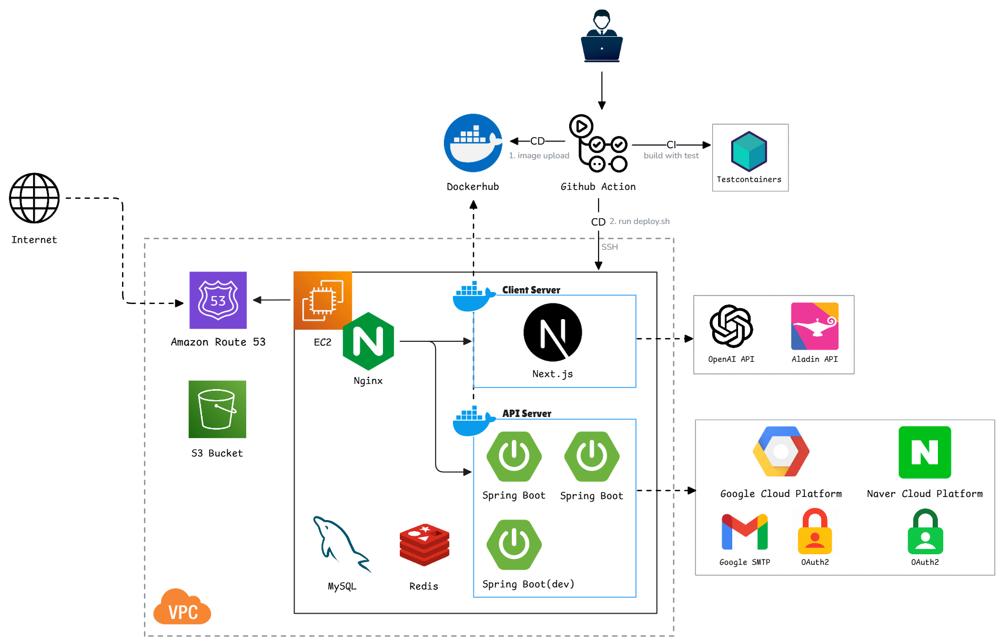

### 시스템 아키텍처 & DB 스키마



- DB 스키마는 [ERD Cloud](https://www.erdcloud.com/d/P4thB83YnLWo4Cbov)에서 확인할 수 있습니다.

---

### 기술 스택
- Backend : Java 17, Spring Boot / Modulith / Security / Data JPA
- Testing : Testcontainers, ArchUnit, JaCoCo
- Infra : MySQL, Redis, AWS S3, Docker

---

### 주요 구현 사항

**1. 모듈형 아키텍처와 검증 자동화**
- Port-Adapter 구조를 적용해 도메인 간 직접 의존을 줄이고, 내부 중심의 의존 흐름을 유지했습니다.
- Spring Modulith를 적용해 기능별 모듈 경계를 분리하고, 모듈 간 제약 위반 사항을 검증할 수 있도록 구성했습니다.
- ArchUnit 테스트를 통해 아키텍처 규칙 위반 시 빌드가 실패하도록 구성했습니다.
- 자세한 사항은 [여기](https://github.com/BOB-BookBridge/BOB-back/wiki/%ED%97%A5%EC%82%AC%EA%B3%A0%EB%82%A0-%EC%95%84%ED%82%A4%ED%85%8D%EC%B2%98-%EB%8F%84%EC%9E%85%EA%B3%BC-ArchUnit%EC%9D%84-%ED%86%B5%ED%95%9C-%EC%95%84%ED%82%A4%ED%85%8D%EC%B2%98-%EA%B2%80%EC%A6%9D)에서 확인해주세요.

**2. SSE 기반 실시간 기능**
- 거래 요청, 상태 변경 알림과 채팅 메시지 수신을 Server-Sent Events 기반으로 구현했습니다.
- 채팅 메시지 전송은 REST API, 수신은 SSE로 분리해 각 통신 목적에 맞는 방식을 적용했습니다.
- 멀티 인스턴스 환경에서는 Redis Pub/Sub을 활용해 서버 간 메시지 전달을 동기화했습니다.
- 자세한 사항은 [여기](https://github.com/BOB-BookBridge/BOB-back/wiki/Server%E2%80%90Sent-Events-%EB%A5%BC-%ED%99%9C%EC%9A%A9%ED%95%9C-%EC%8B%A4%EC%8B%9C%EA%B0%84-%EA%B8%B0%EB%8A%A5-%EA%B5%AC%ED%98%84)에서 확인해주세요.

**3. 계층별 테스트 전략과 품질 관리**
- Domain, Application, Adapter 계층에 맞춰 단위 테스트, 통합 테스트, 인수 테스트 전략을 분리했습니다.
- 반복되는 테스트 설정은 커스텀 테스트 애노테이션으로 정리해 재사용성을 높였습니다.
- JaCoCo를 통해 테스트 커버리지를 검증하고, 기준에 미달하면 빌드가 실패하도록 구성했습니다.
- Testcontainers를 활용해 실제 환경과 유사한 통합 테스트 환경을 구성했습니다.
- 자세한 사항은 [여기](https://github.com/BOB-BookBridge/BOB-back/wiki/%ED%85%8C%EC%8A%A4%ED%8A%B8-%EC%BD%94%EB%93%9C%EB%A5%BC-%ED%86%B5%ED%95%9C-%EC%BD%94%EB%93%9C-%ED%92%88%EC%A7%88-%EA%B4%80%EB%A6%AC-%EB%B0%8F-%EC%95%88%EC%A0%95%EC%84%B1-%ED%99%95%EB%B3%B4)에서 확인해주세요.

### 프로젝트 구조

```text
src/main/java/com/bob
├── admin
├── core
├── global
├── infrastructure
├── integration
├── security
├── shared 
└── statistics
```